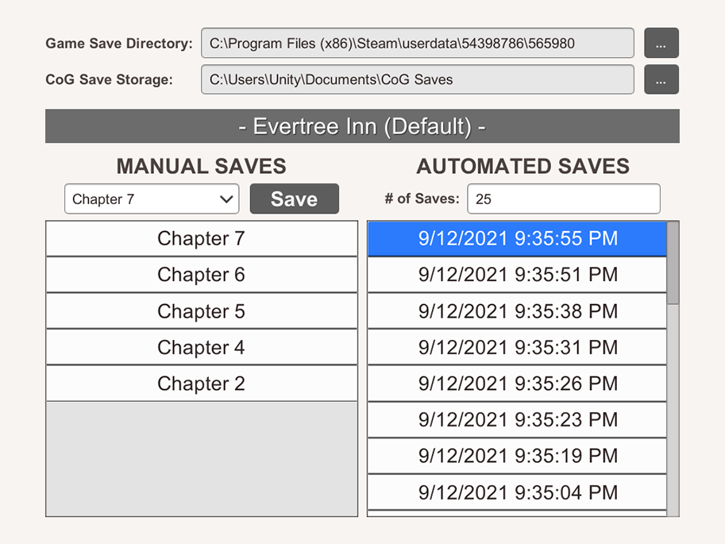
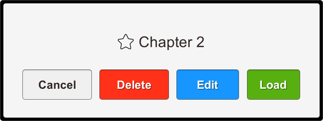
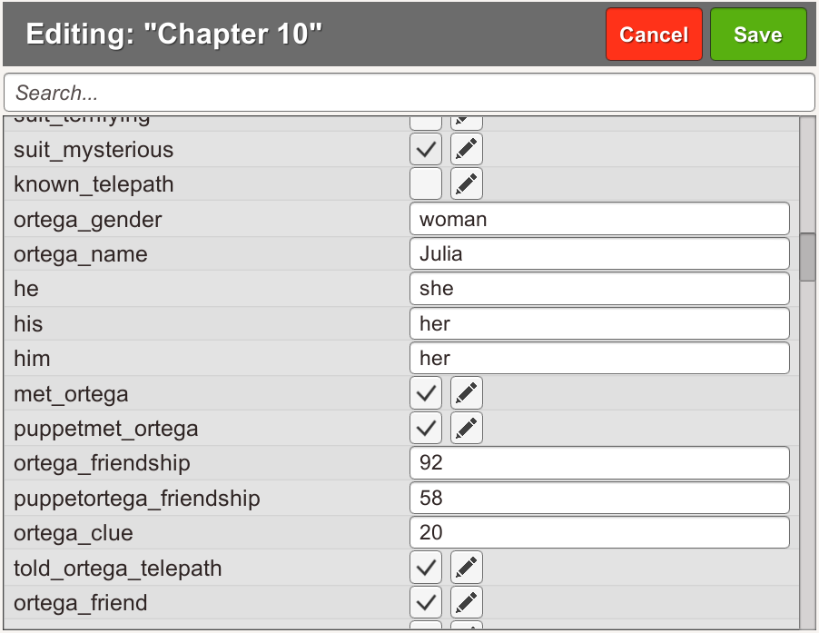
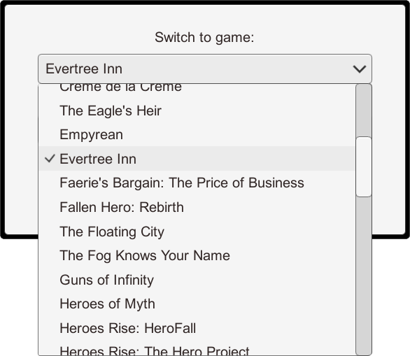
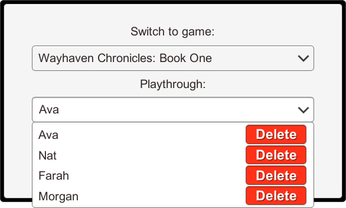

# Choice of Games Save Manager

This is a hobby Unity project that helps manage save files for [Choice of Games](https://store.steampowered.com/search/?publisher=Choice%20of%20Games) and [Hosted Games](https://store.steampowered.com/search/?publisher=Hosted%20Games) that are published on **Steam** platform (tested on Windows only).

The project is created with *Unity 5.6.2f1*, so it can be modified on pretty much any Unity version. For convenience, a portable pre-built Windows executable of the application can be found at the [Releases](https://github.com/yasirkula/UnityChoiceOfGamesSaveManager/releases) page.

**[Support the Developer ☕](https://yasirkula.itch.io/unity3d)**

## HOW TO

- **Game Save Directory:** You first need to select the desired Choice of Game's Steam save directory. Steam save paths have the following format: `{Steam Cloud Save Folder}/{Game ID}`
  - *Steam Cloud Save Folder:* You can find out the location of this directory for each OS [here](https://help.steampowered.com/en/faqs/view/68D2-35AB-09A9-7678)
  - *Game ID:* You can right click the game's shortcut and find this id in the shortcut's URL as follows: `steam://rungameid/{Game ID}`. Alternatively, you can open the game's Store page in a web browser and find the id in the URL
  - To instruct Steam to generate a newly installed game's save directory, you must open the game and either click the *Restart* button or progress through the story for at least one page. Rarely, some games may store their save files in different directories (e.g. *Heroes Rise* trilogy stores all its save files in the first book's save directory, so you have to choose that directory for each game of that trilogy)
- **CoG Save Storage:** Saves generated by this application will be stored at this location. You don't have to give different storage locations for different games because the application automatically groups saves per game
- **Manual Saves:** You can save the game manually at any time by clicking the **Save** button. To change the save's name, you can either type the name into the input field or click the dropdown button and pick one of the previous manual saves' name
- **Automated Saves:** The game is automatically saved as you progress through the story (i.e. whenever you progress to the next page of the game). This way, you can undo your latest choices. Maximum number of automated saves can be configured via "**# of Saves**". Once this number is reached, oldest automated saves will be overwritten with the newest automated saves
- You can load a save by clicking it. For the load operation to work, however, you **must** first close the game and wait a little while for the *Steam Cloud Save* to finish (if enabled). Then, you can load the desired save file and launch the game again

- You can edit a save by clicking it. Similar to loading a save, you **must** first close the game and wait a little while for the *Steam Cloud Save* to finish (if enabled). Before editing an important save, you're recommended to backup it as a separate *Manual Save*, just in case

- To switch between previously explored Choice of Games (without having to change *Game Save Directory* manually at each time), you can click the current game's title ("*- communitycollegehero -*" in the first screenshot) and choose the target game from the list. Every time this application is launched, it tries to populate this list automatically by checking the contents of the Steam save directory. Thus, you probably won't need to enter *Game Save Directory* manually for a game at all, the game will likely be explored automatically by the application at startup

- You can create different playthroughs for each game. Each playthrough will have its own save files. To create a new playthrough or switch between playthroughs, you can click the current game's title ("*- communitycollegehero -*" in the first screenshot) and choose the desired playthrough from the list

